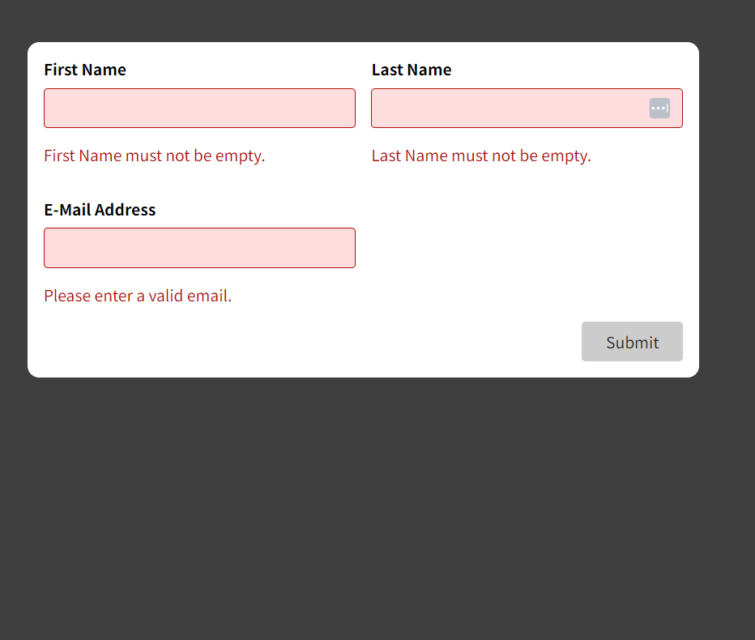

#React Forms with User Input Validation using Custom Hooks
Project Overview
This project demonstrates how to create forms in a React application and implement user input validation using custom hooks. Forms are a crucial part of many web applications, and ensuring that user input is validated correctly helps maintain data integrity and improve user experience.

In this project, we will build a simple form that collects user information, including their first name,last name and email. We will use custom hooks to handle form state and validation. This example can serve as a starting point for more complex forms and validation requirements in your React applications.

App example

